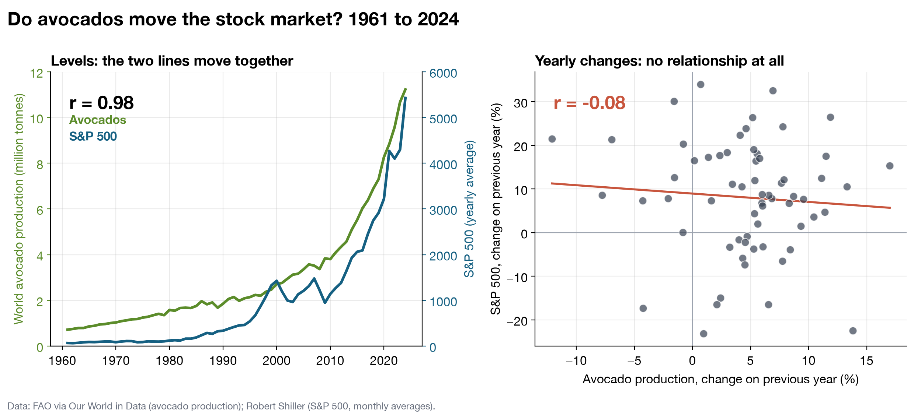
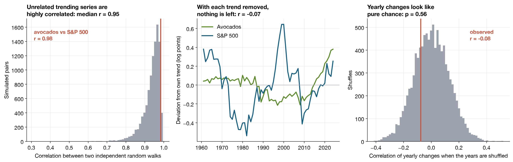

# Spurious correlation in time series

**Do avocados move the stock market?**

World avocado production and the S&P 500 have a correlation of **0.98** over 64 years
(1961 to 2024). This repository uses real public data to show why that number means nothing.



## The short answer

Both series grow over time, and any two series that trend upwards are highly correlated,
whatever they measure. The hidden variable is the calendar.

| Comparison | Correlation |
|---|---|
| Levels (tonnes of avocados against the index value) | **0.98** |
| Yearly changes (% growth against % growth) | **−0.08** |

In the years when avocado production grew more than usual, the market did not do better than
usual. This is why quantitative finance works with returns and not with prices.

## Five checks

One correlation of yearly changes is a start. `src/run_checks.py` asks the same question in
five different ways, and all five give the same answer.



| # | Check | Result | What it says |
|---|---|---|---|
| 1 | Regression in log levels | R² = 0.92, Durbin–Watson = 0.17 | An R² far above the Durbin–Watson statistic is the classic warning sign of a spurious regression (Granger and Newbold, 1974). |
| 2 | Engle–Granger cointegration test | p = 0.28 | No evidence that the two series are tied together in the long run. |
| 3 | Correlation after removing each series' own trend | r = −0.07 | Take the trend away and nothing is left. |
| 4 | Permutation test and bootstrap on yearly changes | p = 0.56, 95% CI [−0.32, 0.19] | The observed correlation is what shuffled, unrelated years produce. |
| 5 | 10,000 pairs of independent random walks | median r = 0.95, 83% of pairs above 0.9 | Series with no relationship at all routinely reach correlations this high. |

The exact figures are in [`results/checks.csv`](results/checks.csv).

### How each check works

1. **Regression in log levels.** Regress the log of the S&P 500 on the log of avocado
   production. The fit looks excellent, but the residuals are almost perfectly autocorrelated:
   the Durbin–Watson statistic is close to 0, where 2 means no autocorrelation. The usual
   t-statistics and R² cannot be trusted in that situation.
2. **Cointegration.** Two trending series have a meaningful long-run relationship only if some
   combination of them is stable over time. The Engle–Granger test checks whether the
   regression residuals are stationary. Here the hypothesis of no cointegration cannot be
   rejected.
3. **Detrending.** Fit a straight line through time to each log series, keep what is left
   over, and correlate the two remainders.
4. **Yearly changes.** Shuffle the years of one series 10,000 times to see which correlations
   arise by chance, and resample the years with replacement to get a confidence interval.
5. **Simulation.** Generate pairs of random walks that are independent by construction, each
   with the average growth and volatility of one of the real series, and measure how
   correlated their levels are.

### Which check is the most informative?

- **Cointegration (2)** is the formal test of the question "is the relationship between the
  levels real?".
- **The simulation (5)** is the most intuitive: series built to be unrelated are correlated
  above 0.9 most of the time.
- **The Durbin–Watson diagnostic (1)** is the quickest to run and catches the problem at once.

## Repository layout

```
├── data/
│   ├── raw/                  the two source files, exactly as downloaded
│   ├── processed/            one tidy table with a row per year
│   └── README.md             sources, licences and column descriptions
├── src/
│   ├── data.py               downloads the data and builds the yearly table
│   ├── plot_correlation.py   main figure
│   ├── run_checks.py         the five checks
│   └── style.py              shared colours and plot settings
├── figures/                  the two figures above
└── results/checks.csv        every number reported in this README
```

## Run it

```bash
pip install -r requirements.txt
python src/data.py               # rebuilds data/processed from data/raw
python src/plot_correlation.py   # main figure
python src/run_checks.py         # the five checks
```

The random seed is fixed, so the results are identical on every run. Tested with Python 3.14.

## Limitations

- **Small sample.** There are 64 yearly observations. The Engle–Granger test has low power
  with so few, so failing to find cointegration is not proof that there is none.
- **Yearly averages.** The S&P 500 value for each year is the mean of its monthly averages,
  which smooths the series compared with year-end prices.
- **Linear trend.** Check 3 removes a straight-line trend from each log series. Neither
  series grows at a perfectly constant rate.
- **The simulation is an illustration, not a test.** Real series are not pure random walks.

## Data

| Series | Source |
|---|---|
| World avocado production, 1961–2024 | FAO, via [Our World in Data](https://ourworldindata.org/grapher/avocado-production) |
| S&P 500, monthly averages | Robert Shiller, via [datasets/s-and-p-500](https://github.com/datasets/s-and-p-500) |

See [`data/README.md`](data/README.md) for licences and column descriptions.

## References

- Yule, G. U. (1926). Why do we sometimes get nonsense-correlations between time-series? *Journal of the Royal Statistical Society*, 89(1), 1–63.
- Granger, C. W. J. and Newbold, P. (1974). Spurious regressions in econometrics. *Journal of Econometrics*, 2(2), 111–120.
- Engle, R. F. and Granger, C. W. J. (1987). Co-integration and error correction. *Econometrica*, 55(2), 251–276.

## Licence

Code under the [MIT licence](LICENSE). The data keep the licences of their sources.
